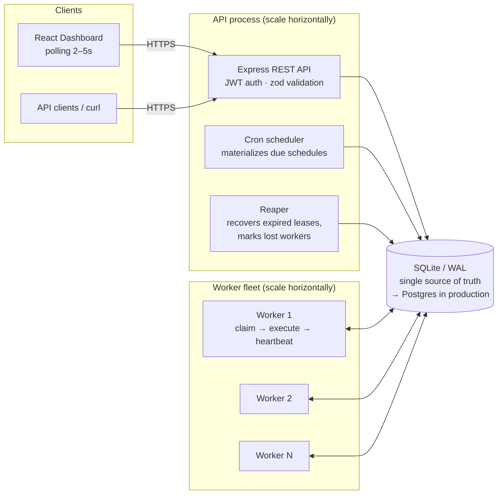
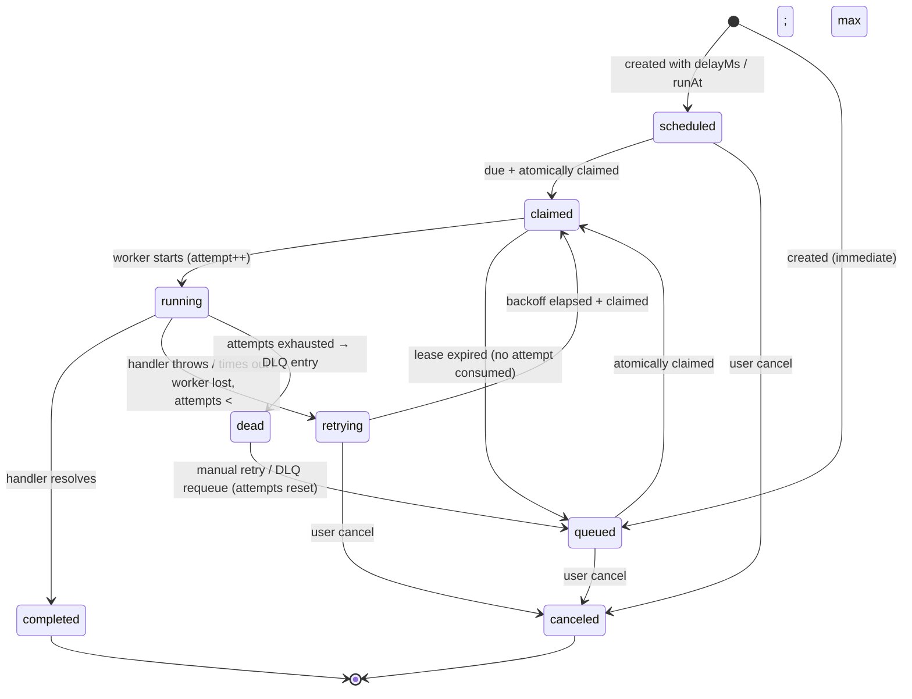

# Architecture

## Overview

The system is three deployable units sharing one database:

There is intentionally **no message broker**: the database is the queue. Workers pull work
with atomic claims; nothing pushes work to them. This keeps the system simple, transactional
(job state and business data commit together), and crash-safe — see
[design-decisions.md](design-decisions.md).

## Components

### API process (`server/src/api`)

Serves REST and hosts two background coordinator loops:

- **Cron scheduler** (`core/scheduler.ts`, 1s tick): finds `scheduled_jobs` with
  `next_run_at <= now`, advances `next_run_at` with a **compare-and-set**
  (`WHERE next_run_at = <value read>`) and inserts a concrete job row for the firing.
  The CAS plus an idempotency key (`sched:<id>:<firing>`) means N API instances can run
  the loop concurrently and a firing is still enqueued exactly once.
- **Reaper** (`core/reaper.ts`, 5s tick): marks workers with stale heartbeats `lost` and
  recovers their jobs (details under *Failure recovery*).

### Worker (`server/src/worker`)

A long-running process, N per deployment:

1. **Registers** itself in `workers` and starts a heartbeat timer (3s) that also renews
   the leases of its in-flight jobs.
2. **Poll loop**: when it has free slots, atomically claims up to that many due jobs
   (single `IMMEDIATE` transaction — see *Atomic claiming*).
3. **Executes** each claimed job concurrently: `claimed → running` (+ execution row,
   attempt counter), runs the registered handler racing a per-job timeout
   (`AbortSignal` passed to the handler for cooperative cancellation).
4. **Settles**: success → `completed` with stored result; failure → the resolved retry
   policy decides `retrying` (with backoff) or `dead` (+ DLQ entry).
5. **Graceful shutdown** on SIGINT/SIGTERM: stops claiming (`draining`), waits for
   in-flight jobs, aborts stragglers after a deadline, marks itself `offline`. If it is
   SIGKILLed instead, the reaper recovers its jobs when the leases expire.

### Dashboard (`web/`)

React SPA. All data flows through the same authenticated REST API, refreshed by a
visibility-aware polling hook (2–5s). No privileged backdoors: the UI can do exactly
what the API allows.

## Job lifecycle

## Atomic claiming (no duplicate execution)

Claiming runs in a single `BEGIN IMMEDIATE` transaction (`core/claims.ts`):

1. A CTE computes per-queue **free capacity**: `concurrency_limit − count(claimed|running)`,
   skipping paused queues.
2. Candidates are ranked with a window function (`ROW_NUMBER() PARTITION BY queue`) so one
   claim never exceeds any queue's remaining capacity, ordered by
   queue priority → job priority → `run_at` → `created_at` (FIFO).
3. `UPDATE jobs SET status='claimed', claimed_by=?, lease_expires_at=? WHERE id IN (…)
   AND status IN ('queued','scheduled','retrying') RETURNING *`.

SQLite serializes writers across processes, so two workers can never claim the same row —
the same guarantee `SELECT … FOR UPDATE SKIP LOCKED` gives on Postgres (the query maps
1:1 when migrating). The status re-check in the `UPDATE` makes the transition itself
compare-and-set, and every subsequent transition (`start`, `complete`, `fail`) is guarded
by `AND status = … AND claimed_by = <me>`, so a stale worker's writes are no-ops.

## Failure recovery (at-least-once execution)

Liveness is lease-based, not connection-based:

- A claim grants a **lease** (`lease_expires_at`); worker heartbeats renew leases for all
  in-flight jobs.
- If a worker dies, heartbeats stop, leases expire, and the reaper:
  - `claimed` (never started) → returned to `queued` — the attempt never began, so the
    retry budget is untouched;
  - `running` → the open execution is closed as `lost` and the job goes through the
    normal retry-policy decision (backoff retry or DLQ), exactly as if the handler had thrown.

The result is **at-least-once** semantics: a job whose worker crashed after doing side
effects but before committing `completed` will run again. Handlers are therefore required
to be idempotent, and the API supports **idempotency keys** at enqueue time
(`UNIQUE(queue_id, idempotency_key)`) to deduplicate producers.

## Live updates

The dashboard polls. WebSockets were considered and deliberately deferred: polling every
2–5s against indexed count queries is cheap at this scale, works through any proxy,
and has no reconnect/fan-out complexity. The API is structured so a WS/SSE layer could be
added as a thin notification channel (poll-on-notify) without touching business logic.
